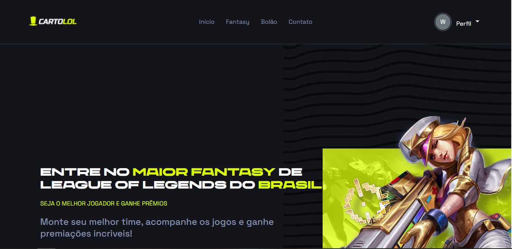

<h1 align="center">
   Pagina inicial Cartolol - Clone
</h1>

<h4 align="center">
  Projeto criado com o intuito de aprimorar meus conhecimentos nas tecnologias HTML, CSS.
</h4>

## 📚 Seções
O projeto é composto por uma pagina que contem 3 seções:

- **Intro:** Contendo informações basicas sobre o funcionamento do site;
- **Cards:** Cards contendo principais funções do site;
- **Divulgação de App mobile:** Divulgação de aplicativo ;

---

## 💼 Tecnologias utilizadas
Para o desenvolvimento deste projeto utilizei as seguintes tecnologias:

- HTML;
- CSS;
---

#### Autor
Willian Stephano